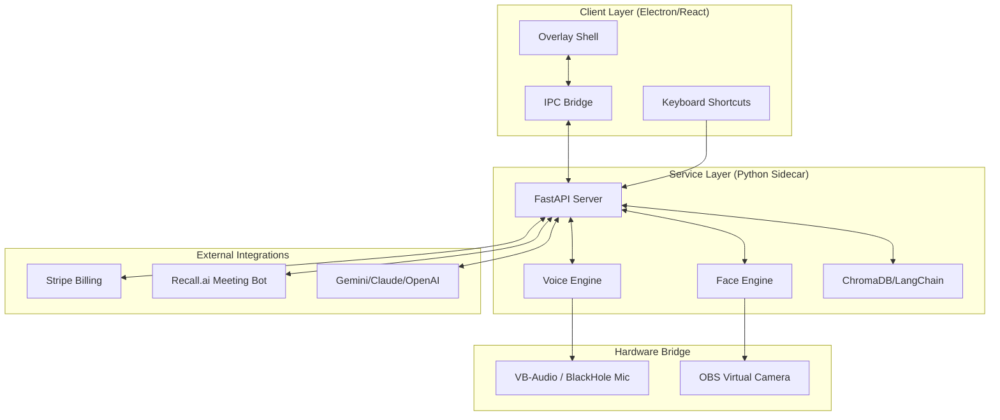

# MeetAI Architecture & System Design 🏗️

This document outlines the internal structure, communication protocols, and data flow of the MeetAI platform.

---

## 1. System Overview

MeetAI is built on a **Dual-Process Architecture**:
1.  **Electron Desktop Shell:** Handles the stealth UI overlay, global keyboard shortcuts, and OS-level screen capture exclusion.
2.  **FastAPI Python Sidecar:** Orchestrates the local ML engines (Voice/Face), RAG pipeline, and external cloud integrations.

### System Diagram

---

## 2. Module Roadmap (Sprint-by-Sprint)

| Sprint | Module | Core Technologies |
| :--- | :--- | :--- |
| **S1** | LLM Orchestration | FastAPI, LiteLLM, Asyncio |
| **S2** | Voice Cloning | VoxCPM2, PyAudio, sounddevice |
| **S3** | Face & Stealth | InsightFace, ONNX, SetWindowDisplayAffinity |
| **S4** | RAG & Bots | ChromaDB, LangChain, Recall.ai API |
| **S5** | Personas & UI | Electron, React, contextBridge |
| **S6** | Hardening & Billing | slowapi, structlog, Stripe SDK |
| **S7** | Quality & Release | Playwright, electron-builder |

---

## 3. Data Flows

### The "Co-Pilot" Loop
1.  **Ingestion:** Recall.ai streams real-time audio → Whisper transcribes in the Sidecar.
2.  **Contextualization:** Transcript line triggers a semantic search in ChromaDB document store.
3.  **Synthesis:** LLM generates a suggestion based on transcript buffer + doc chunks.
4.  **Delivery:** Suggestion is pushed via WebSocket/IPC to the Electron Overlay.

### The "Identity" Switch
1.  **Trigger:** User clicks a Persona profile in the UI.
2.  **Atomic Load:** Sidecar loads the corresponding `.enc` voice and face profiles.
3.  **Activation:** Voice synthesis pipeline switches its reference WAV; Face swap engine switches its source face ONNX buffer.

---

## 4. Security Boundaries

MeetAI identifies three distinct security zones:

- **Zone A: Local (Zero-Persistence):** All biometric data (voice samples, face photos) are processed locally. Raw samples are never uploaded. Encrypted profiles stay on disk.
- **Zone B: Sidecar (Inter-Process):** Communication between Electron and Python is restricted to `localhost`. API endpoints are rate-limited and require a localized machine-id token.
- **Zone C: Cloud (Sanitized):** Only metadata (subscription status) and sanitized text transcripts (for LLM inference) cross the public internet. Webhooks are HMAC-verified.

---

## 5. Deployment Model

MeetAI is deployed as a **Standalone Binary**:
- Python sidecar is bundled into a single `.exe` using **PyInstaller**.
- Electron app is bundled into an **NSIS Installer** via **electron-builder**.
- Auto-updates are delivered over HTTPS with code-signed signature verification.
